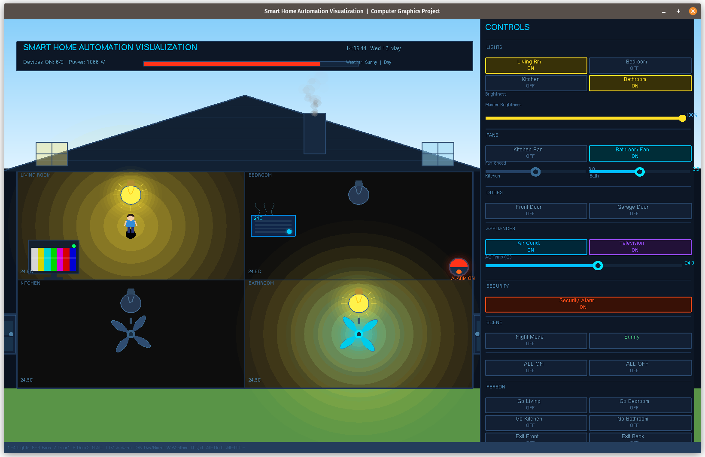

# 🏠 Smart Home Automation Visualization
### An Interactive 2D Computer Graphics Simulation in OpenGL / GLUT




<!-- <p align="center">
  
</p> -->

> **Course:** Computer Graphics  
> **Language:** C++ with OpenGL (GLUT, GLU)  
> **Platform:** Linux (tested on Pop!_OS / Ubuntu) — portable to Windows & macOS  
> **Author:** Musfique  
> **Year:** 2026

---

## 📖 Project Overview

The **Smart Home Automation Visualization** is an interactive 2D simulation that visualizes a fully working smart home using only OpenGL primitives (lines, triangles, quads, circles). The user can control lights, fans, doors, an air-conditioner, a television, and a security alarm through an in-app sidebar GUI or keyboard shortcuts. The simulation also features a **person animation module** that walks between rooms and triggers smart-device automation in real time.

This project demonstrates core Computer Graphics concepts:

- 2D primitive rendering and transformations
- Color blending and gradients (sky, glow, shadows)
- Animation via timer callbacks
- Particle systems (rain, chimney smoke)
- Mouse / keyboard interaction handling
- Modular software architecture (multi-file C++ project)
- Coordinate-space mapping for fullscreen mouse interaction

---

## ✨ Key Features

### 🏘️ House Visualization
- Four fully detailed rooms — **Living Room, Bedroom, Kitchen, Bathroom**
- Decorated roof with tiles, chimney, animated smoke, and front-facing windows
- Sun / Moon, dynamic gradient sky, animated stars, clouds, and rain

### 💡 Smart Devices
| Device | Rooms | Controls |
|--------|--------|----------|
| LED Lights | All 4 rooms | On/off + master brightness |
| Ceiling Fans | Kitchen, Bathroom | On/off + speed (1–5) |
| Air Conditioner | Bedroom | On/off + temperature (16–30 °C) |
| Television | Living Room | On/off (animated color bars) |
| Doors | Front, Garage/Back | Animated open/close |
| Security Alarm | House-wide | Pulsing visual + audible state |

### 🌦️ Environment Modes
- **Day / Night Mode** — alters sky, lighting, and window glow
- **Weather Cycle** — Sunny ☀ / Cloudy ⛅ / Rainy 🌧

### 📊 Live Status Dashboard
- Real-time clock
- Active device counter
- Color-graded power consumption bar (green → yellow → red)

### 🚶 Person Animation Module *(modular file)*
- An animated character can be commanded to walk between rooms
- Auto turns ON appropriate devices on entry
- Auto turns OFF devices on exit
- Two house-exit options: Front Door or Back/Garage Door

### 🖱️ UI / UX
- Sidebar with categorized control buttons and sliders
- Hover and active-state feedback
- Fullscreen-aware mouse mapping (logical coordinate remapping)
- Keyboard shortcut hint bar

---

## 🗂️ Project Structure
SmartHomeProject/
├── smart_home.cpp # Main rendering, GUI, devices, weather, scenes
├── person_animation.h # Public API for the person animation module
├── person_animation.cpp # Person walking + auto on/off logic
└── README.md # Project documentation
└── screenshot.png    

### Modular Architecture

The project is split into **two translation units** to demonstrate clean modular design:

1. **`smart_home.cpp`** — Core graphics engine, rendering, GUI, and input handling.
2. **`person_animation.cpp` / `.h`** — Encapsulated character animation with its own state machine and per-room automation rules.

This separation enables the person logic to evolve independently without touching the main renderer.

---

## ⚙️ Build & Run Instructions

### 🐧 Linux (Pop!_OS / Ubuntu / Debian)

#### 1. Install dependencies
```bash
sudo apt update
sudo apt install build-essential freeglut3-dev
```

#### 2. Compile
```bash
g++ smart_home.cpp person_animation.cpp -o smart_home -lGL -lGLU -lglut
```

#### 3. Run
```bash
./smart_home
```

### 🪟 Windows (MinGW + freeglut)
```bash
g++ smart_home.cpp person_animation.cpp -o smart_home.exe -lfreeglut -lopengl32 -lglu32
```

### 🍎 macOS
```bash
g++ smart_home.cpp person_animation.cpp -o smart_home -framework OpenGL -framework GLUT
```

---

## 🎮 Controls Reference

### Mouse
| Action | Effect |
|---------|--------|
| Left-click button | Toggle device / trigger action |
| Drag slider knob | Adjust brightness / fan speed / AC temperature |
| Hover button | Visual feedback highlight |

### Keyboard — Devices
| Key | Action |
|-----|--------|
| `1` `2` `3` `4` | Toggle Living / Bedroom / Kitchen / Bathroom lights |
| `5` `6` | Toggle Kitchen / Bathroom fan |
| `7` `8` | Toggle Front / Garage door |
| `9` | Toggle Air Conditioner |
| `T` | Toggle Television |
| `A` | Toggle Security Alarm |
| `D` / `N` | Day / Night mode |
| `W` | Cycle Weather |
| `0` | All devices ON |
| `-` | All devices OFF |
| `Q` | Quit |

### Keyboard — Person Animation
| Key | Action |
|-----|--------|
| `L` | Send person to Living Room |
| `B` | Send person to Bedroom |
| `K` | Send person to Kitchen |
| `H` | Send person to Bathroom |
| `F` | Exit through Front Door |
| `G` | Exit through Garage / Back Door |

---

## 🧠 How Auto-Automation Works

When the person enters a room, `person_animation.cpp` calls `applyRoomAutoOn(room)` which turns on the predefined devices for that room. When the person leaves (or moves to a different room), `applyRoomAutoOff(room)` reverses it.

You can **customize per-room behavior** by simply commenting / uncommenting lines:

```cpp
case 0: // LIVING ROOM
    lightOn = true;     // turn on light
    tvOn       = true;     // turn on TV
    // acOn   = true;      // (uncomment to also turn on AC)
    break;
```

This gives easy control:
- 💡 **Only LED:** keep just the `lightOn[i]` line.
- 🎛️ **Full smart mode:** uncomment everything.
- 🔇 **No auto-off:** comment out the lines inside `applyRoomAutoOff`.

---

## 🧩 Technical Highlights

### Coordinate System
- Logical coordinate space: **1100 × 740 px**
- Reshape callback maintains the logical projection regardless of physical window size, ensuring fullscreen support.

### Fullscreen Mouse Mapping
A custom `mapMouse()` helper rescales raw GLUT mouse pixel coordinates back to the logical projection, allowing button hit-testing to remain accurate even after `glutFullScreen()` is invoked.

```cpp
x = (float)mx * (float)WIN_W / (float)gWinW;
y = (float)(gWinH - my) * (float)WIN_H / (float)gWinH;
```

### Animation Engine
A 60 FPS GLUT timer drives:
- Fan blade rotation (proportional to speed)
- Door open/close interpolation
- Alarm pulse
- Smoke and rain particle systems
- Person walk cycle and pathfinding

### Particle Systems
- **Smoke:** spawned periodically from the chimney with randomized velocity and lifespan.
- **Rain:** 80 droplets that wrap around the screen when active.

---

## 📈 Computer Graphics Concepts Demonstrated

| Concept | Where Used |
|----------|-------------|
| 2D Primitives | Rectangles, triangles, circles, line strips |
| Transformations | Fan blade rotation via trigonometric vertex computation |
| Color Interpolation | Sky gradient, button hover, status bar |
| Alpha Blending | Glows, smoke, rain, glass windows |
| Animation Loop | `glutTimerFunc(16, …)` ≈ 60 FPS |
| Particle System | Smoke + rain |
| Event Handling | Mouse + keyboard callbacks |
| Coordinate Mapping | Fullscreen mouse remapping |
| Modular Design | Header + two translation units |

---

## 🚀 Future Enhancements

- Add a **temperature simulation** that responds to AC and weather
- Multi-character animations and pathfinding around walls
- Save / load home configurations to disk
- Convert to **3D** using `glRotatef`, lighting, and textures
- Voice command integration via external library

---

## 🧑‍💻 Author

**Musfique**  
Department of Computer Science & Engineering  
Course: *Computer Graphics*  
Year: 2026

---

## 📜 License

This project is developed for academic and educational purposes.  
You are free to study, modify, and extend it for personal learning.

---

> *"Graphics is not just about drawing pixels — it's about telling a story with shapes, color, and motion."*